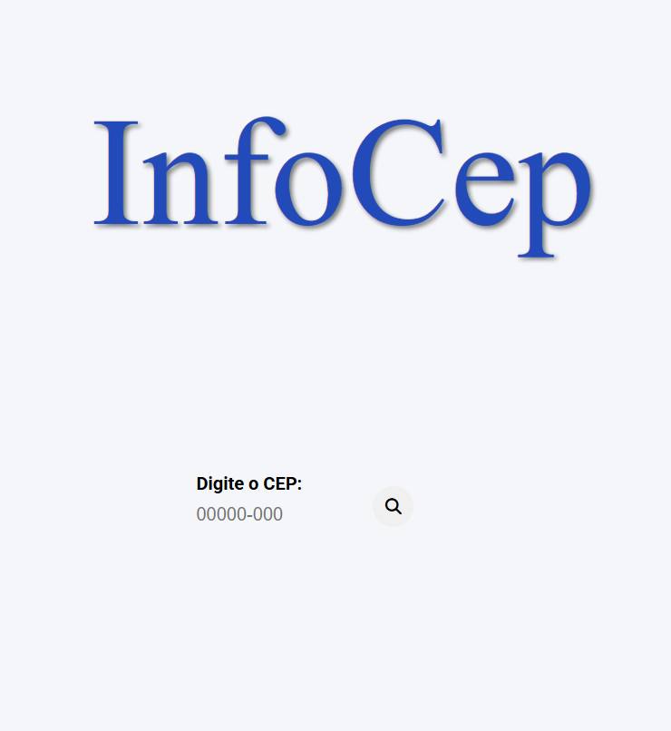
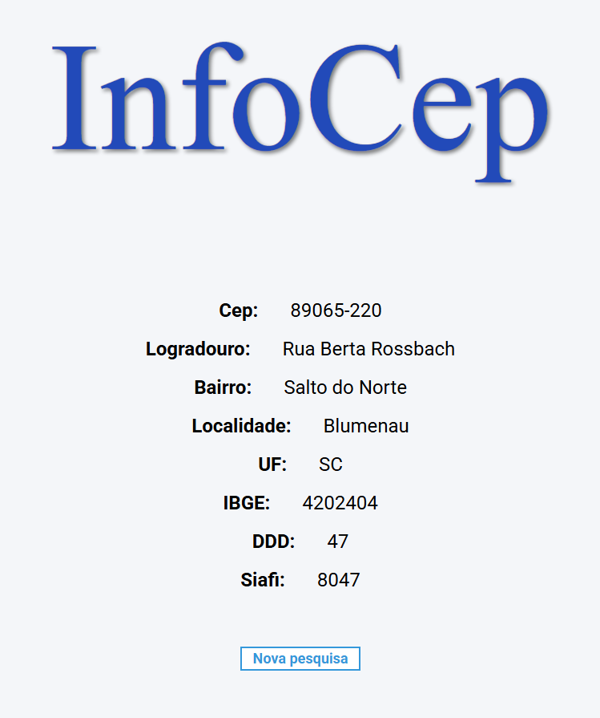
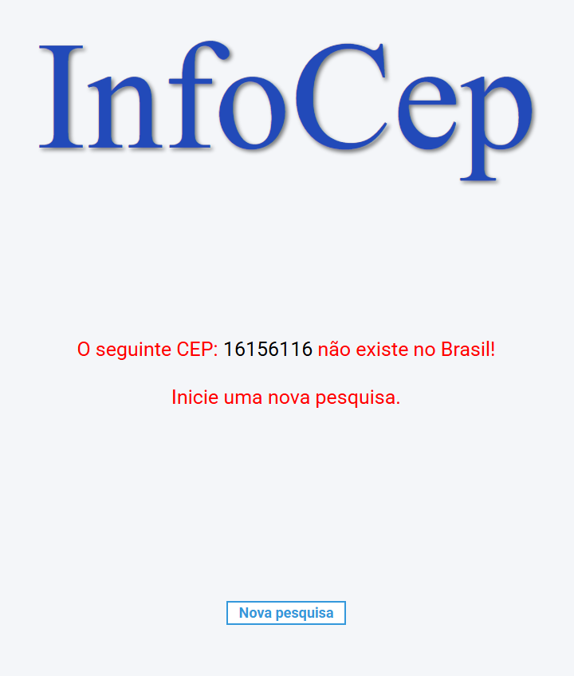

<h1 align="center">
  InfoCep
</h1>


O **InfoCep** é uma aplicação simples que permite aos usuários consultar informações sobre um CEP (Código de Endereçamento Postal) no Brasil. O projeto utiliza a API [ViaCEP](https://viacep.com.br/) para buscar os dados e exibi-los de forma prática.
## Tecnologias
 
- [Spring Boot](https://spring.io/projects/spring-boot)
- [Spring MVC](https://docs.spring.io/spring-framework/reference/web/webmvc.html)
- [Thymeleaf](https://www.thymeleaf.org/)
- [HTML](https://developer.mozilla.org/pt-BR/docs/Web/HTML)
- [CSS](https://developer.mozilla.org/pt-BR/docs/Web/CSS)
- [JavaScript](https://developer.mozilla.org/pt-BR/docs/Web/JavaScript)

## Deploy 
 
A aplicação está disponível publicamente no link abaixo:

🔗 **InfoCep** — https://infocep.onrender.com

Você pode acessar, realizar buscas de CEP e visualizar o retorno em tempo real diretamente pela interface.

## Práticas adotadas

- SOLID, DRY, YAGNI, KISS
- API REST
- Injeção de Dependências
- Tratamento de respostas de erro

## Como Executar

- Clonar repositório git
- Construir o projeto:
```
$ ./mvnw clean package
```
- Executar a aplicação:
```
$ java -jar target/infoCep-0.0.1-SNAPSHOT.jar
```

A API poderá ser acessada em [localhost:8080](http://localhost:8080).

## Funcionalidades das Páginas
Explicação de cada página e suas funcionalidades:

- **index.html**: Esta é a página principal da aplicação, onde o usuário pode informar o CEP, ao preencher o campo e submeter, ele é direcionado para a página de resultados.



- **resultadoCep.html**: Após o envio do CEP na página inicial, essa página exibe as informações correspondentes ao CEP informado, como endereço, bairro, cidade e estado. Ela apresenta os dados de forma clara para o usuário.



 Caso o CEP seja inválido ou não seja encontrado, um parágrafo de erro aparece na página em vermelho, alertando o usuário sobre o problema. 
 
 
 
 E independente do resultado haverá a presença do botão “Nova pesquisa” que retorna o usuário a página principal.

 
## Funcionalidades do Back-End

### Endpoints da API

### 1. `GET /` - Página Inicial

- **Descrição**: Retorna a página inicial da aplicação. Não retorna dados em JSON, apenas renderiza o template `index.html`.

---

### 2. `POST /buscarCep` - Buscar informações de um CEP

- **Descrição**: Recebe um CEP e retorna informações detalhadas sobre esse CEP.

- **Método**: `POST`
- **URL**: `/buscarCep`
- **Parâmetros**:
  - `cep` (String) – O CEP no formato `XXXXX-XXX`, por exemplo, `01001-000`.
